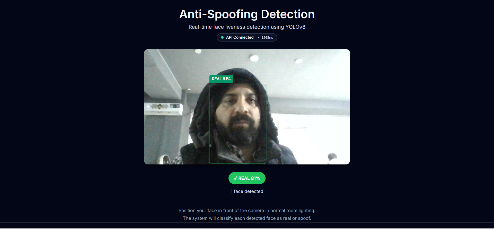

# YOLO Liveness Detector

## Anti-Spoofing & Liveness Detection System

A production-ready, edge-optimized anti-spoofing (liveness detection) platform for face-based authentication systems.  
The system classifies faces as **REAL** vs **FAKE** (printed images, phone screens, TV displays) using custom-trained YOLO models, supporting cloud, browser, and fully offline mobile inference.

This project is designed for **real-world deployment**, not academic benchmarks.

### Why This Project Exists

Face recognition systems are inherently vulnerable to spoofing attacks such as:

- **Printed photographs**
- **Mobile phone displays**
- **TV or video replays**
- **Static image injection**

This project adds a dedicated **liveness verification layer** that ensures a physically present human before any identity verification step.

Unlike generic models trained on public datasets, this system is trained in the **target environment**, dramatically improving real-world accuracy and robustness.

### Key Capabilities

#### Core Features

- **REAL vs FAKE classification** using a single-stage YOLO detector
- **Custom dataset collection** in ~20 minutes using automated labeling
- **Real-time inference** (30+ FPS on GPU, optimized for edge; slower but usable on CPU/Docker)
- **Multi-face detection** per frame
- **Blur-aware data filtering** for high-quality training data

#### Deployment Modes

- **Web** (Next.js + Three.js) with premium UX overlays
- **Backend API** (FastAPI + Docker) for server or edge devices
- **Mobile** (React Native) with fully on-device inference
- **Offline-first** architecture for privacy-critical use cases

### System Architecture (Conceptual)

```text
Web (Next.js + Tailwind + Three.js)
        │
        │ HTTP (REST)
        ▼
FastAPI Inference Service (Docker)
        │
        │ PyTorch / ONNX (configurable)
        ▼
YOLO Anti-Spoofing Model

React Native Mobile App
(Camera → Native Inference → UI)
        │
        ▼
ONNX Runtime (Android) / CoreML (iOS)
```

### Design Principles

- **Training ≠ Inference** (strict separation of concerns)
- **No UI logic in backend**
- **No images leave device in mobile mode**
- **Hardware-aware optimization** (CPU, GPU, NNAPI, Metal)
- **Environment-specific data** over generic datasets

### Model & Data Strategy

#### Data Collection

- Automated face detection using MediaPipe (`cvzone.FaceDetectionModule`)
- Auto-labeling in YOLO format
- **Blur filtering** via Laplacian variance
- Confidence-based face filtering

Supports:

- Live webcam faces
- Phone screens
- Printed photos
- TV/video content

A typical dataset:

- ~7,000 images
- Balanced **REAL / FAKE** classes
- Collected in ~20 minutes

#### Model

- YOLOv8 (Nano → Large supported)
- Exportable to **ONNX** for cross-platform deployment
- Quantization options:
  - **INT8** (Android / CPU edge)
  - **FP16** (GPU / iOS)

### Frontend Experience

#### Web (Next.js)

- Live camera capture
- Smooth face overlays
- Color-coded liveness status:
  - **Green → REAL**
  - **Red → FAKE**
- Confidence indicators (percentage)
- Three.js depth and ambient feedback for premium UX

#### Mobile (React Native)

- Fully offline inference
- Zero-copy camera frames (VisionCamera)
- Hardware-accelerated ML (NNAPI / Metal)
- Battery-aware execution
- Privacy-first (no network dependency for inference)

### Mobile Edge Inference (Key Differentiator)

- **No backend required** on mobile
- **No biometric data leaves device**
- Deterministic, low-latency inference
- Works in low-connectivity or air-gapped environments

Suitable for:

- KYC & onboarding
- Attendance systems
- Secure access control
- Exam proctoring
- Workforce authentication

### Technology Stack

#### Backend

- FastAPI
- Docker
- YOLOv8 (Ultralytics)
- ONNX Runtime
- TensorRT / OpenVINO (optional, via custom builds)

#### Web

- Next.js (App Router)
- Tailwind CSS
- shadcn-style UI components
- Three.js for ambient visuals

#### Mobile

- React Native
- `react-native-vision-camera`
- ONNX Runtime (Android)
- CoreML + Metal (iOS)

### What This Project Is (and Is Not)

**It Is:**

- A deployable anti-spoofing (liveness) layer
- Edge-ready and privacy-preserving
- Environment-specific and accurate
- Designed for real production systems

**It Is Not:**

- A face recognition / identification system
- A biometric identity store
- A generic one-model-fits-all solution

### Typical Use Cases

- Face-based login systems
- KYC verification flows
- Secure attendance tracking
- Access control gates / turnstiles
- Exam and remote proctoring
- Workforce identity verification

### Roadmap / Extensions

- Temporal liveness checks (blink, micro-motion, challenge-response)
- Face recognition pipeline integration
- Model drift monitoring in production
- Edge device benchmarking and profiles
- WebRTC streaming support
- Confidence-based policy enforcement (threshold-based actions)

### Summary

This project demonstrates how **production** computer vision systems should be built:

- **Data first**
- **Automation over manual labeling**
- **Environment-specific training**
- **Edge-optimized deployment**
- **Clean separation of concerns**

A focused implementation produces a real, defensible, deployable anti-spoofing system that you can adapt to your own environment.

---

## 🎬 Demo

<p align="center">
  <a href="Anti-Spoofing%20Detection.mp4">
    
  </a>
</p>

> 📹 **[Watch Full Demo Video](Anti-Spoofing%20Detection.mp4)** - Real-time face liveness detection (real vs spoof) with live camera overlay

---

## Architecture & Flow

### Components

- **Backend (`app/`, FastAPI + YOLOv8)**  
  - Exposes `POST /v1/predict` for image-based liveness detection  
  - Exposes `GET /v1/health` for model/device status  
  - Loads a YOLOv8 model from `MODEL_PATH` and runs inference on CPU or GPU (`DEVICE`)

- **Web frontend (`frontend/`, Next.js)**  
  - Uses the browser camera (`react-webcam`) to capture frames  
  - Sends JPEG snapshots to the backend via `/v1/predict` at a throttled FPS  
  - Renders bounding boxes and labels (`REAL` / `FAKE`) over the live video  
  - Shows API connection status + latency in the header

- **Mobile app (`mobile/`, React Native)**  
  - Uses `react-native-vision-camera` to access frames on-device  
  - Designed to run inference locally via ONNX Runtime (Android) or CoreML (iOS)  
  - Does **not** depend on the FastAPI backend for liveness decisions

- **Training pipeline (`training/`)**  
  - `data_collection.py`: collects labeled face crops (fake/real) with blur-based filtering  
  - `split_data.py`: builds YOLO-format train/val/test splits and `data.yaml`  
  - `train.py`: trains a YOLOv8 model for `fake` vs `real` classification

### Request flow (web camera → backend → UI)

1. **Camera capture (browser)**  
   - `CameraFeed` uses `react-webcam` to grab frames at a configured FPS.  
   - Frames are passed to `FrameCapture` as base64 JPEGs.

2. **Frame → image file (frontend)**  
   - `FrameCapture` draws the frame to an off-screen `<canvas>`, converts it to a JPEG `Blob`, and wraps it in a `File`.  
   - A single in-flight guard ensures only **one** `/v1/predict` request is active at a time.

3. **HTTP request (frontend → backend)**  
   - `predictImage` in `frontend/lib/api.ts` sends the `File` as `multipart/form-data` to `POST /v1/predict` using Axios.  
   - The base URL is taken from `NEXT_PUBLIC_API_BASE_URL` (usually `http://localhost:8000`).

4. **Inference (backend)**  
   - FastAPI endpoint `app/api/v1/predict.py`:
     - Validates and reads the uploaded file  
     - Decodes it to an OpenCV image (`decode_image`)  
     - Runs `ModelWrapper.predict(...)` (YOLOv8) with `CONFIDENCE_THRESHOLD` and image size from settings  
     - Post-processes YOLO outputs in `postprocess_results` (boxes, class IDs → `fake` / `real`)  
     - Returns `faces[]` + `latency_ms` as JSON

5. **Rendering (frontend)**  
   - `FrameCapture` receives the `PredictionResponse` and calls `onDetection`.  
   - `Home` page updates state: `detections` + `latency`.  
   - `FaceBoxes` overlays scaled bounding boxes + labels over the live video.  
   - `StatusBadge` shows overall status (`REAL` / `FAKE` / `MIXED`) with highest confidence.  
   - Header pill shows API status (`Checking / Connected / Not available`) and latest `latency_ms`.

6. **Health checking**  
   - On page load and every 10s, the frontend calls `GET /v1/health`.  
   - If `model_loaded` is true, the UI marks the API as **Connected**; otherwise it shows **API not available**.

### High-level data flow

- **Web**: Camera → JPEG frame → FastAPI `/v1/predict` → YOLOv8 → JSON → bounding boxes & labels overlay.  
- **Mobile**: Camera → native frame preprocessing → ONNX/CoreML model → labels → overlay (fully on-device).  
- **Training**: Collected images + labels → YOLO training → `.pt` model → deployed as `MODEL_PATH` in backend or exported to ONNX/CoreML for mobile.

### Sequence diagram (web path)

```text
User
  │
  │ opens web UI
  ▼
Browser (Next.js / React)
  │
  │ camera frame (react-webcam)
  ▼
FrameCapture (canvas)
  │
  │ draw frame → JPEG → multipart/form-data
  ▼
Axios client (frontend/lib/api.ts)
  │  POST /v1/predict
  ▼
FastAPI backend (app/api/v1/predict.py)
  │  decode_image()  →  preprocess_image()
  │  ModelWrapper.predict() (YOLOv8)
  │  postprocess_results() → format_detections()
  ▼
JSON response (faces[], latency_ms)
  │
  │ onDetection() updates React state
  ▼
FaceBoxes / StatusBadge
  │
  └─> Draw boxes + REAL/FAKE labels over live video
```

---

## Quickstart (Windows 10/11, PowerShell)

### 1) Backend (FastAPI) — local (recommended first)

From repo root:

```powershell
python -m venv .venv
.\.venv\Scripts\Activate.ps1
pip install -r requirements.txt

# Run API
uvicorn app.main:app --host 0.0.0.0 --port 8000 --reload
```

Verify:

```powershell
Invoke-RestMethod http://localhost:8000/v1/health
```

### 2) Web Frontend (Next.js)

In a new terminal:

```powershell
cd .\frontend
npm install

# Point frontend to backend
$env:NEXT_PUBLIC_API_BASE_URL="http://localhost:8000"

npm run dev
```

Open `http://localhost:3000` and allow camera permissions.

### 3) Backend via Docker (end-to-end)

From repo root:

```powershell
docker compose up --build -d
docker compose ps
```

Health check:

```powershell
Invoke-RestMethod http://localhost:8000/v1/health
```

Test `/v1/predict` with a local image:

```powershell
$imgPath = "E:\path\to\test.jpg"
Invoke-RestMethod -Method Post `
  -Uri "http://localhost:8000/v1/predict" `
  -Form @{ file = Get-Item $imgPath }
```

Stop:

```powershell
docker compose down
```

---

## API

### `GET /v1/health`

Returns model status + uptime.

### `POST /v1/predict`

**Notes:**

- The model detects **liveness** (real vs fake faces). To detect screen-based spoofs (faces shown on phones/tablets), the training data must include examples of such spoofs labeled as `fake`.
- The original training approach uses **blur detection** during data collection - screen-based faces tend to be blurrier, which helps the model learn.
- Use `CONFIDENCE_THRESHOLD` in `.env` to trade off recall vs precision (default `0.25`).

Multipart form upload:

- field name: `file`
- types: `image/jpeg`, `image/png`

Response:

- `faces[]`: each has `label` (`real|fake`), `confidence` (0..1), `bbox` (`x,y,w,h`)
- `latency_ms`

---

## Configuration

Copy `.env.example` → `.env` (optional). Key vars:

- `MODEL_PATH` (default `model/anti_spoofing.pt`)
- `CONFIDENCE_THRESHOLD` (default `0.25`, lower = more detections but also more noise)
- `DEVICE` (`auto|cpu|cuda`)

---

## Training (Offline scripts)

### Data Collection

File: `training/data_collection.py`

**Important:** This script uses **blur detection** to ensure only focused faces are saved. Faces shown on mobile screens/phones tend to be blurrier than real faces, which helps the model learn to distinguish them.

**How to collect data:**

1. **For FAKE class (classID = 0):**
   - Run the script with `classID = 0`
   - Show **faces on mobile screens** (photos/videos on phones/tablets) to the camera
   - Show **printed photos** of faces
   - The script will only save frames where faces are detected AND blur value > threshold (focused enough)

2. **For REAL class (classID = 1):**
   - Run the script with `classID = 1`
   - Show **live faces** directly to the camera
   - Ensure good lighting and focus

**Key parameters:**

- `blurThreshold = 35`: Higher = more strict focus requirement (default 35 works well)
- `confidence = 0.8`: Face detection confidence threshold
- `classID`: Set to `0` for fake, `1` for real before running

**Output:** `Dataset/DataCollect/*.jpg` + `*.txt` (YOLO format labels)

**After collection:** Manually copy all collected images to `Dataset/all/` before splitting.

### Split to YOLO format

File: `training/split_data.py`

- Reads from `Dataset/all/` (you must copy collected data here first)
- Creates `Dataset/SplitData/{train,val,test}/{images,labels}` + `data.yaml`
- Split ratio: 70% train, 20% val, 10% test

### Train YOLO

File: `training/train.py`

- Trains a YOLOv8 model using the generated `data.yaml`
- Default: `yolov8n.pt` (nano), 300 epochs, batch size 16
- Best model saved to `runs/anti_spoofing/weights/best.pt`

**Class mapping:** The model outputs `class 0 = fake, class 1 = real` (matches `classNames = ["fake", "real"]`).

---

## Mobile (React Native) — current state

Directory: `mobile/`

Implemented:

- VisionCamera-based camera view
- JS-side detection coordinator + throttling
- Native module stubs:
  - Android: `mobile/android/.../YoloModule.kt` (ONNX Runtime + NNAPI hook)
  - iOS: `mobile/ios/YoloModule.swift` (CoreML/Vision hook)

Not yet turnkey:

- You must export your model to **ONNX** and place it at:
  - `mobile/assets/anti_spoofing.onnx`
- You must wire native frame preprocessing properly (currently placeholder).

See docs:

- `docs/mobile.md`

---

## Project Layout

```text
app/                 FastAPI runtime
training/            Offline training/data scripts
frontend/            Next.js web UI
mobile/              React Native app scaffold
docker/              Dockerfiles
tests/               Backend tests
docs/                Extra documentation
model/               Model artifacts (anti_spoofing.pt)
```
